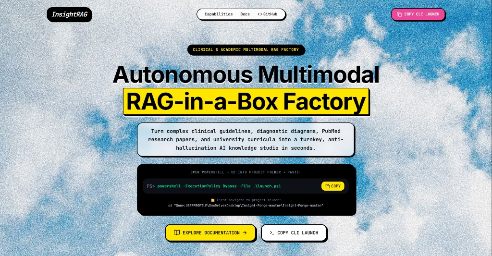

<div align="center">

# ⚡ INSIGHT • RAG
### 🧠 Autonomous Multimodal Local RAG-in-a-Box Factory
**Zero-Budget • 100% On-Device Vector Privacy • Hardware Auto-Tuned • Multimodal Vision OCR**

<br />

```
  ___           _       _     _     ____      _    ____ 
 |_ _|_ __  ___(_) __ _| |__ | |_  |  _ \    / \  / ___|
  | || '_ \/ __| |/ _` | '_ \| __| | |_) |  / _ \| |  _ 
  | || | | \__ \ | (_| | | | | |_  |  _ <  / ___ \ |_| |
 |___|_| |_|___/_|\__, |_| |_|\__| |_| \_\/_/   \_\____|
                  |___/                                 
```

<br />

<p align="center">
  <a href="#-1-line-quickstart"><b>⚡ Quickstart</b></a> •
  <a href="#-key-capabilities"><b>🌟 Capabilities</b></a> •
  <a href="#%EF%B8%8F-system-architecture"><b>🏗️ Architecture</b></a> •
  <a href="#-visual-roi-diagram-cropping"><b>👁️ Visual ROI</b></a> •
  <a href="#-advance-turbo-cloud-server-mode"><b>🚀 Turbo Mode</b></a> •
  <a href="https://github.com/SypherKx/InsightRAG"><b>💻 GitHub Repo</b></a>
</p>

[](https://fastapi.tiangolo.com)
[](https://react.dev)
[](https://vitejs.dev)
[](https://github.com/facebookresearch/faiss)
[](https://ollama.com)
[](https://opensource.org/licenses/MIT)

<br />
<br />



</div>

---

## 📖 Overview

**InsightRAG AI** is an autonomous, local-first multimodal Retrieval-Augmented Generation (RAG) factory. It turns messy PDFs, Word documents, scanned forms, and images into a private, turnkey, anti-hallucination AI knowledge microservice in seconds — **with zero mandatory API bills and 100% on-device data privacy**.

---

## ⚡ 1-Line Quickstart

### 🪟 Windows 10 / 11 (PowerShell)
Open PowerShell in the repository root directory and run:

```powershell
powershell -ExecutionPolicy Bypass -File .\launch.ps1
```

*What `launch.ps1` does automatically:*
1. Profiles system hardware (CPU cores, RAM, GPU/VRAM).
2. Verifies Python 3.10+ and Node.js/npm.
3. Checks and starts local **Ollama** in the background.
4. Auto-installs backend & frontend dependencies.
5. Starts the FastAPI backend (`http://localhost:8000`) and Vite frontend (`http://localhost:5173`).
6. Automatically launches the **Knowledge Base Studio** (`http://localhost:5173/app/upload`) in your browser once ready!

---

### 🐧 Linux / macOS / Manual Python Launch

```bash
# 1. Clone the repository
git clone https://github.com/SypherKx/InsightRAG.git
cd InsightRAG

# 2. Run the automated local runner
python scripts/run_local.py
```

---

## 🌟 Key Capabilities

### 1. 🧠 Speed-Tiered On-Device Embeddings
Configure the exact speed vs. precision tradeoff tailored to your machine:
* **⚡ `all-MiniLM-L6-v2` (Ultra-Fast 5x • 4GB+ RAM • 384-dim)**: Blazing fast CPU-friendly inference for laptops and quick tests.
* **⚖️ `bge-small-en-v1.5` (Balanced 3x • 6GB+ RAM • 384-dim)**: Top retrieval accuracy for standard desktop PCs.
* **🧠 `bge-base-en-v1.5` (SOTA High Precision • 8-16GB RAM/GPU • 768-dim)**: State-of-the-art dense semantic capture for clinical research & academic depth.
* **🚀 `nomic-embed-text` (Ollama Native 8K • 8GB+ RAM • 768-dim)**: High-context 8,192 token window for large book chapters and clinical trials.

### 2. 👁️ Multimodal Vision & OCR
* Ingests scanned clinical reports, lab printouts, whiteboard lecture notes, and textbook diagrams.
* Extracts structured text and tabular information with automated image preprocessing.

### 3. 🛡️ Anti-Hallucination & Privacy Guardrails
* **100% On-Device Vector Store**: Indexing with `faiss-cpu` ensures HIPAA and FERPA-compliant privacy with zero data leaving your machine.
* **Strict Source Attributions**: Every LLM response is anchored to exact document passages, page numbers, and cosine similarity confidence scores.
* **Hypothetical Document Embeddings (HyDE)**: Expands ambiguous queries to bridge vocabulary gaps between student questions and academic textbook text.

### 4. 📦 Standalone Knowledge Export
* Export your indexed knowledge base as a standalone microservice bundle (`.zip`) that can run offline in air-gapped environments.

---

## 🏗️ System Architecture

```
┌────────────────────────────────────────────────────────────────────────┐
│                        InsightRAG AI Pipeline                          │
└────────────────────────────────────────────────────────────────────────┘

 [ Documents / Scans ] ──> [ Multimodal Ingestion ] ──> [ Overlapping Chunker ]
   • Clinical PDFs           • OCR Vision Extraction      • 500 chars (50 ovlp)
   • PubMed Studies          • Table & Text Normalizer    • Token-Aware Splitting
   • Textbooks & Notes
                                                                 │
                                                                 ▼
 [ User Natural Query ]                                 [ Dense Embedding Engine ]
          │                                               • all-MiniLM-L6-v2 (384d)
          ▼                                               • bge-small / bge-base
 [ HyDE Query Expander ] ──> [ Cosine Similarity ] ───>   • nomic-embed-text (8k)
                               (FAISS IndexFlatIP)               │
                                       │                         ▼
                                       ▼                 [ Vector Knowledge Base ]
                             [ Grounded RAG Prompt ]       • 100% Local FAISS Store
                                       │                   • Metadata Attribution
                                       ▼
                         [ Local LLM / Cloud Fallback ]
                           • Ollama (llama3.2 / qwen)
                           • Optional: Groq / Gemini / Claude
                                       │
                                       ▼
                       [ Cited, Explainable Answer ]
```

---

## 📂 Repository Structure

```
InsightRAG/
├── backend/                      # FastAPI Backend & RAG Engine
│   ├── main.py                   # App entrypoint & CORS middleware
│   ├── config.py                 # Pydantic configuration & model parameters
│   ├── routers/                  # API routers (rag, dataset, anomalies, system)
│   ├── services/                 # RAG pipeline, embedding loader & Ollama manager
│   └── storage/                  # SQLite database models & session management
│
├── frontend/                     # React 19 + Vite 7 Frontend Application
│   ├── src/
│   │   ├── routes/               # TanStack Router pages (/, /docs, /app/upload)
│   │   ├── components/           # Neo-Brutalist design system & studio cards
│   │   ├── services/             # Axios API client & WebSocket handlers
│   │   └── styles.css            # Tailwind CSS styling & animations
│   └── package.json              # Frontend dependencies
│
├── src/                          # Core analytical and RAG modules
│   ├── detection/                # Vital anomaly detection algorithms
│   ├── explainer/                # Prompt generators & context formatting
│   ├── ingestion/                # Document cleaning & format parsers
│   └── rag/                      # FAISS store, chunkers, & vector retriever
│
├── scripts/                      # Utility & automation scripts
│   ├── run_local.py              # Cross-platform Python local runner
│   └── generate_obsidian_vault.py# Obsidian knowledge graph generator
│
├── launch.ps1                    # 1-Click PowerShell launcher for Windows
└── README.md                     # Project documentation
```

---

## 🔌 REST API Reference

| Method | Endpoint | Description |
|---|---|---|
| `GET` | `/health` | Server health check and uptime status |
| `POST` | `/api/v1/rag/upload` | Upload and vectorize PDF, DOCX, CSV, TXT files |
| `POST` | `/api/v1/rag/query` | Perform grounded RAG query with source citations |
| `GET` | `/api/v1/rag/documents` | List all active indexed knowledge documents |
| `GET` | `/api/v1/system/hardware` | Retrieve CPU cores, RAM, and GPU profiling stats |
| `GET` | `/api/v1/system/ollama-models`| List installed and running Ollama models |

---

## 🛠️ Environment Configuration

Create a `.env` file in the project root:

```env
# RAG Configuration
RAG_ENABLED=true
EMBEDDING_MODEL=all-MiniLM-L6-v2

# Local LLM (Ollama)
LLM_PROVIDER=ollama
OLLAMA_BASE_URL=http://127.0.0.1:11434
LLM_MODEL=llama3.2:3b

# Optional: Cloud Fallback Keys
GROQ_API_KEY=
OPENAI_API_KEY=
GEMINI_API_KEY=
```

---

## 👤 Author & Credits

Designed and built with ❤️ by **[Karan Pratap Singh](https://github.com/SypherKx)**.

Contributions and pull requests are welcome! If you find InsightRAG helpful, please star ⭐ the repository.
